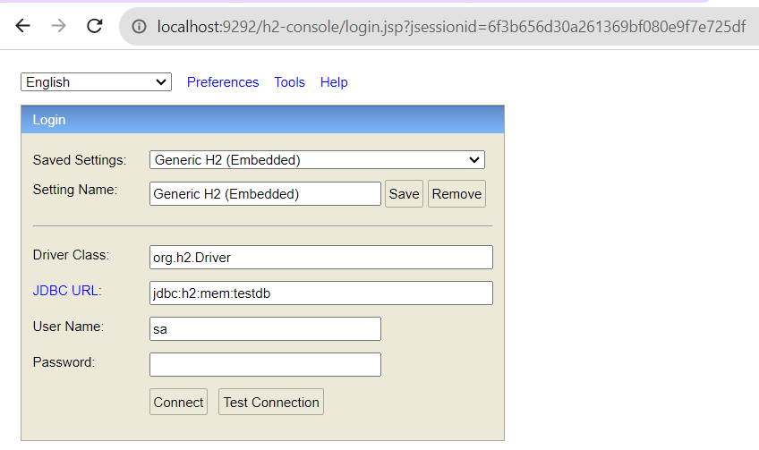

# code-test
Code test Example With Input Validations

# H2 Console : Here i am using H2 In Memory database for testing
http://localhost:9292/h2-console/

JDBC URL : jdbc:h2:mem:testdb
DB Name : testdb

# Swagger Url : Use Swagger UI to test the Apis
Swagger Ur  : http://localhost:9292/swagger-ui.html

1.API to cretae Employee : POST Method

URL : http://localhost:9292/api/v1/create-employee

Curl Command Request:

curl --location 'http://localhost:9292/api/v1/create-employee' \
--header 'Content-Type: application/json' \
--header 'Authorization: 12345' \
--data-raw '{
  "doj": "2021-06-09",
  "email": "nagendraolive@gmail.com",
  "firstName": "Bathula",
  "lastName": "Nagendra",
  "phoneNumbers": [
    "99083069XX",
    "96665591XX"
  ],
  "salary": 1250000
}'

Response :

{
    "employeeId": 1,
    "firstName": "Bathula",
    "lastName": "Nagendra",
    "email": "nagendraolive@gmail.com",
    "phoneNumbers": [
        "99083069XX",
        "96665591XX"
    ],
    "doj": "2021-06-09T00:00:00.000+00:00",
    "salary": 1250000.0
}

2.API to get Tax Caliculation based on employeeId : GET Method

URL : http://localhost:9292/api/v1/tax-deduction/1

curl -X GET --header 'Accept: application/json' --header 'Authorization: 12345' 'http://localhost:9292/api/v1/tax-deduction/1'

Response Body :

{
  "employeeCode": 1,
  "firstName": "Bathula",
  "lastName": "Nagendra",
  "yearlySalary": 8750000,
  "taxAmount": 1612500,
  "cessAmount": 125000
}
